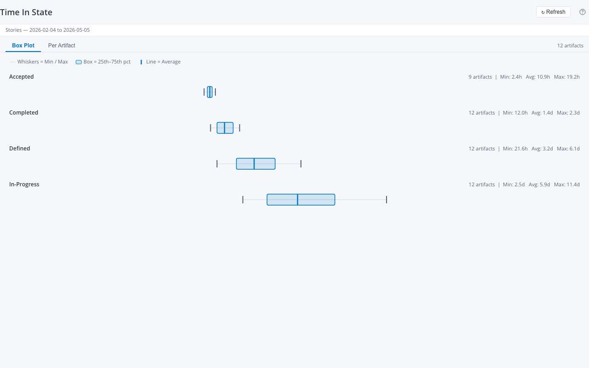

# Time In State

A Rally Custom View widget that shows how long each artifact spent in each workflow state, using the Rally **Lookback API** (historical snapshots).



---

## What It Shows

For each artifact type (Stories, Defects, Tasks, etc.) over a configurable date window:

- **Box Plot tab** — Min, 25th percentile, average, 75th percentile, and max days-in-state for each state across all artifacts in scope
- **Per Artifact tab** — Table of every artifact with its time in each state (days or hours)

Only durations longer than 1 hour are counted, to filter out snapshot noise.

---

## Legacy Reference

This widget ports the **TimeInState** custom Rally app:

- Legacy source: `code-viewer/dist/apps-html/TimeInState-App-20260412-213615.html`
- Original behavior: Lookback snapshot query → per-artifact state accumulation → Highcharts box plot

Key differences from legacy:
- Pure React + SVG box plot (no Highcharts dependency)
- Both chart and per-artifact table views
- Settings via EditMode panel (no separate settings dialog)
- Date inputs are ISO `<input type="date">` (no ExtJS date picker)

---

## Features

- Lookback API snapshot queries with automatic pagination
- Supports: Stories, Defects, Tasks, TestCases, Portfolio Items
- Configurable date window (default: 90 days)
- Optional state filter (e.g. show only "Defined, In-Progress")
- Box plot visualization with Min / p25 / Mean / p75 / Max
- Per-artifact table with linked FormattedIDs
- EditMode settings panel

---

## Setup

See **[docs/setup-guide.md](docs/setup-guide.md)** for end-to-end setup.

Quick start:

```bash
npm install
npm run dev         # Dev server (mock data) at http://localhost:5175
npm run build       # Production IIFE bundle (live Rally data)
npm run build:mock  # Mock bundle (no Rally credentials needed)
npm run typecheck   # TypeScript check
```

---

## Settings

| Setting | Default | Description |
|---------|---------|-------------|
| Artifact Type | Stories | Stories, Defects, Tasks, TestCases, or Portfolio |
| Portfolio Item Type | Feature | Only shown when Artifact Type = Portfolio |
| Start Date | 90 days ago | Start of the snapshot query window |
| End Date | Today | End of the snapshot query window |
| States to Show | (all) | Comma-separated list of state values to include |

---

## Source

- `src/App.tsx` — Main widget component (EditMode settings + Chart/Table tabs)
- `src/types.ts` — `ArtifactTimeInState`, `StateStats`, `TimeInStateDataProvider`, `TimeInStateSettings`
- `src/data-provider.ts` — Live Rally Lookback provider (`queryLookback`)
- `src/mock-data.ts` — 12 mock stories + defects/tasks/test cases/portfolio items
- `src/components/StateBarChart.tsx` — SVG box-plot visualization
- `src/components/ArtifactTable.tsx` — Per-artifact detail table
- `src/components/useTimeInStateData.ts` — Data-fetching hook + stats computation
- `src/main.tsx` — Entry point, mock/live branching

---

## Lookback Query Details

The widget issues one Lookback query per render:

```json
{
  "find": {
    "_TypeHierarchy": "<lbapi-type>",
    "_ValidFrom": { "$gt": "<startDate>T00:00:00.000Z" },
    "_ValidTo": { "$lt": "<endDate>T23:59:59.999Z" }
  },
  "fields": ["ObjectID", "FormattedID", "Name", "_ValidFrom", "_ValidTo", "<stateField>"],
  "hydrate": ["<stateField>"],
  "pagesize": 2000
}
```

Snapshots are grouped by `(ObjectID, stateValue)` and durations accumulated. Any bucket with total duration ≤ 1 hour is discarded.

---

## Rally References

- [Lookback API documentation](https://rally1.rallydev.com/analytics/doc)
- Legacy app source: `TimeInState-App-20260412-213615.html` (App Catalog)
